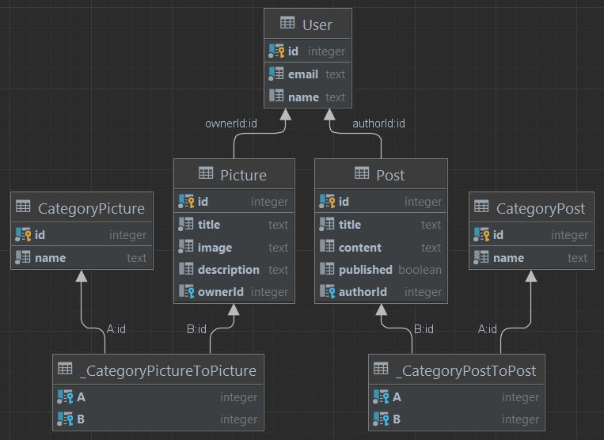

## Автор
___
Кулешова Екатерина Дмитриевна, группа M33031

## Описание
___

Посмотреть приложение на хостинге heroku можно по ссылке: <a href="https://nook-of-madness.herokuapp.com/" target="blank">Уголок безумия</a>

## ERD
___

* ### User

    Пользователь - основная сущность в системе.

  * **id** - уникальный идентификатор пользователя в системе. Генерируется автоматически
  * **email** - обязательное текстовое поле. Можно заменить в любой момент, но значение должно быть уникальным в системе.
  * **name** - необязательное текстовое поле. Можно заменить в любой момент, уникальность не требуется 

  Также, у каждого пользователя есть связанные с ним посты и картинки. По сути, приложение, это личный дневник. Каждый может загрузить свои данные.

  * **posts** - собирается из таблицы Post, где внешний ключ authorId совпадает с id текущего пользователя. Доступна сортировка постов по категориям и по авторам. Посты других авторов видны, если установлено соответствующее поле (см. ниже)
  * **pictures** - собирается из таблицы Picture, где внешний ключ ownerId совпадает с id текущего пользователя. Личная галерея, картинки доступны только пользователям, которые их загружают.

* ### Post

    Сущность, хранящая в себе пост/заметку. Необходима для создания ленты постов.

  * **id** - уникальный идентификатор поста в системе. Генерируется автоматически
  * **title** - Обязательное текстовое поле, не может быть пустым. Заменить можно в любой момент, уникальность не требуется
  * **content** - Текстовое поле заполняется по желанию. Изменить можно в любой момент
  * **published** - Флаг видимости поста. Можно изменить в любой момент.
      * При установке в `true` делает пост доступным в поиске другим пользователям. 
      * При установке в `false` пост виден только автору. --**Значение по умолчанию**--
  * **authorId** - Обязательное поле, числовая строка. Заполняется при создании и в дальнейшем не меняется. id пользователя, создавшего данный пост. Можно получить список постов, опубликованных конкретным пользователем.
  * **categories** - список категорий, к которым относится пост. Может быть пустым. По категориям можно настроить поиск

* ### CategoryPost

    Категория для постов. Позволяет группировать посты по группам.

  * **id** - уникальный идентификатор категории поста в системе. Генерируется автоматически
  * **name** - Обязательное текстовое поле.
  * **posts** - список постов, которые отнесены к данной категории

* ### Picture

    Сущность, хранящая в себе картинку. В нашем случае используется для личной галереи пользователя.
    
  * **id** - уникальный идентификатор картинки в системе. Генерируется автоматически
  * **image** - Обязательное текстовое поле. URL, по которому хранится необходимая картинка. Можно изменить в любой момент, уникальность не требуется.
  * **title** - Обязательное текстовое поле. Можно изменить в любой момент, уникальность не требуется.
  * **description** - Необязательное текстовое поле. Описание, связанное с текущей картинкой. Можно изменить в любой момент.
  * **ownerId** - Обязательное поле, числовая строка. Заполняется при создании и в дальнейшем не меняется. id пользователя, создавшего данную картинку. Можно получить список картинок, опубликованных конкретным пользователем.

* ### CategoryPicture

    Категория картинки. Позволяет группировать картинки по группам.

  * **id** - уникальный идентификатор категории картинки в системе. Генерируется автоматически
  * **name** - Обязательное текстовое поле.
  * **pictures** - список картинок, которые отнесены к данной категории
